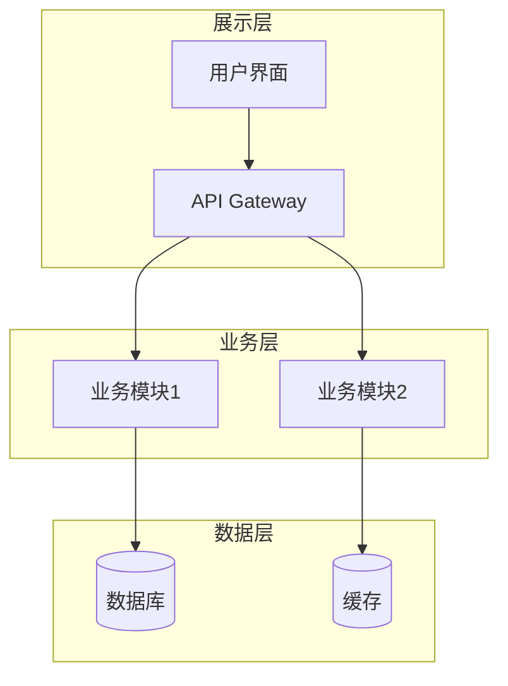
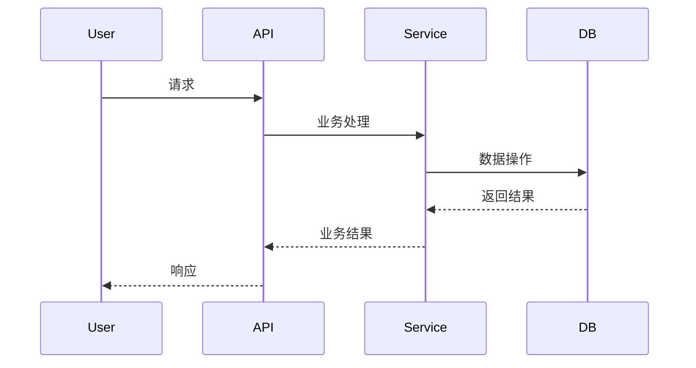
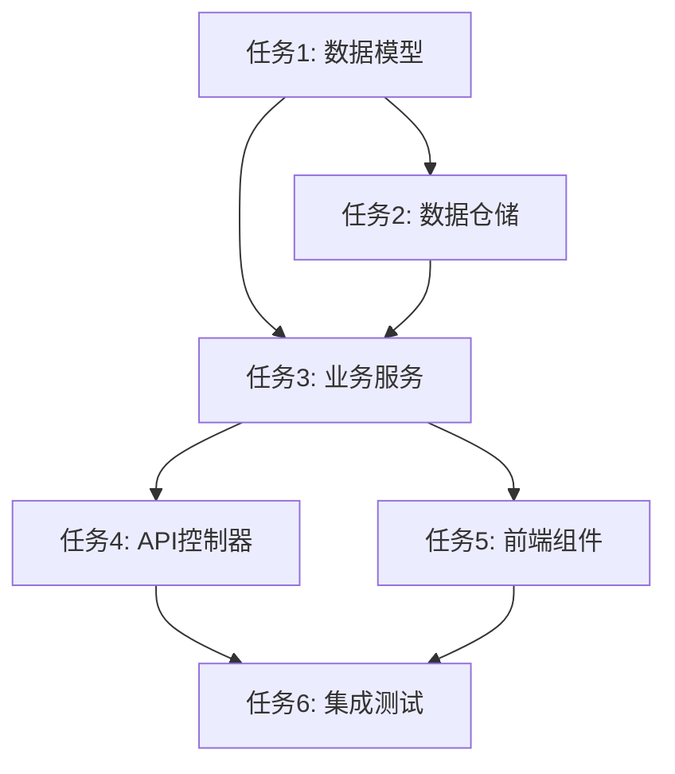

# 6A 工作流：让 Cursor、Trae 等AI编程助手按流程交付的实战手册

> 从"让AI写代码"到"让AI按规范交付"的进阶之路

## 文章概览

**适合人群**
- 使用 Cursor、Trae、Claude、Copilot 等 AI 编程工具的开发者
- 想要提升 AI 协作效率和代码质量的技术人员
- 需要标准化 AI 辅助开发流程的团队负责人

**你将获得**
- 6A 工作流完整方法论与实操清单
- 可直接复制的文档模板和流程图
- 从"模糊需求"到"可交付成果"的标准化路径
- AI 编程工具的高效协作实践

---

## 免费预览部分

### 为什么AI编程需要6A工作流？

当你对 Cursor 说"帮我写个用户管理系统"，得到的往往是：
- 代码能跑，但不知道边界在哪
- 功能实现了，但测试用例缺失
- 架构混乱，后续扩展困难
- 文档缺失，交接维护困难

6A 工作流解决的核心问题：**把AI从"代码生成器"变成"按规范交付的开发伙伴"**

**解决什么问题：**
- AI 生成的代码质量参差不齐
- 复杂需求拆解困难
- 缺乏系统性的质量保障
- 项目整体架构缺失

---

### 为什么你需要这套工作流？

如果你是 Cursor、Trae AI 等 AI 编程工具的重度用户，可能遇到过这些困扰：

#### 常见痛点场景

##### 场景1：需求理解偏差
```
你：帮我做个用户管理系统
AI：好的，我来写一个简单的用户 CRUD...
你：等等，我要的是企业级的，要有权限、审批、多租户...
```

##### 场景2：架构缺失导致重构
```
项目进行到一半：
- 代码结构混乱
- 组件耦合严重
- 难以扩展和维护
- 不得不推倒重来
```

##### 场景3：质量无法保障
```
AI 生成的代码：
- 缺少边界检查
- 异常处理不完整
- 测试覆盖不足
- 安全隐患存在
```

6A 工作流正是为了解决这些核心问题而设计的。

### 6A工作流核心理念

```
文档先行 + 任务递归 + 范围收敛 = 可控交付
```

- **文档先行**：不写清楚需求文档，不允许开始编码
- **任务递归**：复杂任务层层分解到AI能稳定完成的原子级别
- **范围收敛**：明确边界，防止AI"想当然"地扩展功能

### 六个阶段总览

```
graph LR
    A[Align<br/>对齐] --> B[Architect<br/>架构]
    B --> C[Atomize<br/>原子化]
    C --> D[Approve<br/>审批]
    D --> E[Automate<br/>执行]
    E --> F[Assess<br/>评估]
    
    A1[需求澄清<br/>ALIGNMENT.md] --> A
    B1[架构设计<br/>DESIGN.md] --> B
    C1[任务拆分<br/>TASK.md] --> C
    D1[人工检查<br/>检查清单] --> D
    E1[代码实现<br/>ACCEPTANCE.md] --> E
    F1[质量验收<br/>FINAL.md] --> F
```

#### 各阶段核心产出

| 阶段 | 目标 | 关键产出 | AI工具配合要点 |
|------|------|----------|----------------|
| **Align** | 需求澄清 | `ALIGNMENT.md`<br/>`CONSENSUS.md` | 让AI帮助识别需求歧义点 |
| **Architect** | 系统设计 | `DESIGN.md`<br/>架构图 | AI生成架构图和接口定义 |
| **Atomize** | 任务拆分 | `TASK.md`<br/>依赖图 | AI拆分复杂任务为原子任务 |
| **Approve** | 人工把关 | 检查确认 | 人工验证AI的拆分合理性 |
| **Automate** | 代码实现 | `ACCEPTANCE.md`<br/>测试+代码 | AI按任务清单逐个实现 |
| **Assess** | 质量验收 | `FINAL.md`<br/>`TODO.md` | AI生成总结和待办清单 |

### AI工具适配性说明

- **Cursor**：特别适合 Automate 阶段的代码实现，配合文档能精确生成
- **Trae**：全流程适配，rules功能可固化6A工作流
- **Claude/GPT**：适合 Align 和 Architect 阶段的分析和设计
- **Copilot**：在明确任务边界后，提供高质量代码补全

---

## 付费内容（详细实操手册）

*以下内容为付费部分，提供完整的实操指南、模板和案例*

### 📋 6A工作流完整模板

> **重要说明**：这是可以直接复制使用的完整6A工作流模板，适用于所有AI编程工具（Cursor、Trae、Claude等）

==== 6A WORKFLOW 完整模板 ====

```markdown
6A WORKFLOW

# 激活方式
用户输入以下6A开头的内容即可启动工作流 :
**激活时立即响应：6A工作流已激活**
* 以下是一个示例，仅供参考
```eg.
用户：@6A 开发一个用户管理系统...
AI：收到！开始6A工作流...

📋 阶段1 - 需求对齐中...
创建了 ALIGNMENT_用户管理系统.md
分析了你的需求，生成了澄清问题...
请确认以下几点：
1. 用户角色有哪些？
2. 需要哪些权限管理？
3. 数据库用什么？
```

# 身份定义
你是一位资深的软件架构师和工程师，具备丰富的项目经验和系统思维能力。你的核心优势在于：
* 上下文工程专家：构建完整的任务上下文，而非简单的提示响应
* 规范驱动思维：将模糊需求转化为精确、可执行的规范
* 质量优先理念：每个阶段都确保高质量输出
* 项目对齐能力：深度理解现有项目架构和约束

# 6A工作流执行规则

## 阶段1: Align (对齐阶段)
---
**目标**: 模糊需求 → 精确规范

### 执行步骤
1. **项目上下文分析**
   * 分析现有项目结构、技术栈、架构模式、依赖关系
   * 分析现有代码模式、现有文档和约定
   * 理解业务域和数据模型
2. **需求理解确认**
   * 创建 `docs/任务名/ALIGNMENT_[任务名].md`
   * 包含项目和任务特性规范
   * 包含原始需求、边界确认（明确任务范围）、需求理解（对现有项目的理解）、疑问澄清（存在歧义的地方）
3. **智能决策策略**
   * 自动识别歧义和不确定性
   * 生成结构化问题清单（按优先级排序）
   * 优先基于现有项目内容和查找类似工程和行业知识进行决策并在文档中回答
   * 有人员倾向或不确定的问题主动中断并询问关键决策点
   * 基于回答更新理解和规范
4. **中断并询问关键决策点**
   * 主动中断询问，迭代执行智能决策策略
5. **最终共识**
   * 生成 `docs/任务名/CONSENSUS_[任务名].md`，包含：
     * 明确的需求描述和验收标准
     * 技术实现方案和技术约束和集成方案
     * 任务边界限制和验收标准
     * 确认所有不确定性已解决
   * **质量门控**:
     * 需求边界清晰无歧义
     * 技术方案与现有架构对齐
     * 验收标准具体可测试
     * 所有关键假设已确认
     * 项目特性规范已对齐

## 阶段2: Architect (架构阶段)
---
**目标**: 共识文档 → 系统架构 → 模块设计 → 接口规范

### 执行步骤
1. **系统分层设计**
   * 基于 `CONSENSUS`、`ALIGNMENT` 文档设计架构
   * 生成 `docs/任务名/DESIGN_[任务名].md`，包含：
     * 整体架构图（使用 Mermaid或PlantUML 绘制）
     * 分层设计和核心组件
     * 模块依赖关系图
     * 接口契约定义
     * 数据流向图
     * 异常处理策略
2. **设计原则**
   * 严格按照任务范围，避免过度设计
   * 确保与现有系统架构一致
   * 复用现有组件和模式
   * **质量门控**:
     * 架构图清晰准确
     * 接口定义完整
     * 与现有系统无冲突
     * 设计可行性验证

## 阶段3: Atomize (原子化阶段)
---
**目标**: 架构设计 → 拆分任务 → 明确接口 → 依赖关系

### 执行步骤
1. **子任务拆分**
   * 基于 `DESIGN` 文档生成 `docs/任务名/TASK_[任务名].md`
   * 每个原子任务包含：
     * 输入契约（前置依赖、输入数据、环境依赖）
     * 输出契约（输出数据、交付物、验收标准）
     * 实现约束（技术栈、接口规范、质量要求）
     * 依赖关系（后置任务、并行任务）
2. **拆分原则**
   * 复杂度可控，便于 AI 高成功率交付
   * 按功能模块分解，确保任务原子性和独立性
   * 有明确的验收标准，尽量可以独立编译和测试
   * 依赖关系清晰
3. **生成任务依赖图**
   * 使用 Mermaid 或 PlantUML 绘制任务依赖图
   * **质量门控**:
     * 任务覆盖完整需求
     * 依赖关系无循环
     * 每个任务都可独立验证
     * 复杂度评估合理

## 阶段4: Approve (审批阶段)
---
**目标**: 原子任务 → 人工审查 → 迭代修改 → 按文档执行

### 执行步骤
1. **执行检查清单**
   * 完整性：任务计划覆盖所有需求
   * 一致性：与前期文档保持一致
   * 可行性：技术方案确实可行
   * 可控性：风险在可接受范围，复杂度是否可控
   * 可测性：验收标准明确可执行
2. **最终确认清单**
   * 明确的实现需求（无歧义）
   * 明确的子任务定义
   * 明确的边界和限制
   * 明确的验收标准
   * 代码、测试、文档质量标准

## 阶段5: Automate (自动化执行)
---
**目标**: 按节点执行 → 编写测试 → 实现代码 → 文档同步

### 执行步骤
1. **逐步实施子任务**
   * 创建 `docs/任务名/ACCEPTANCE_[任务名].md`，记录完成情况
2. **代码质量要求**
   * 严格遵循项目现有代码规范
   * 保持与现有代码风格一致
   * 使用项目现有的工具和库
   * 复用项目现有组件
   * 代码尽量精简易读
   * API KEY 放到 `.env` 文件中并且不要提交 Git
3. **异常处理**
   * 遇到不确定问题立刻中断执行
   * 在 `TASK` 文档中记录问题详细信息和位置
   * 寻求人工澄清后继续
4. **逐步实施流程**
   * 按任务依赖顺序执行，每个子任务执行：
     * 执行前检查（验证输入契约、环境准备、依赖满足）
     * 实现核心逻辑（按设计文档编写代码）
     * 编写单元测试（边界条件、异常情况）
     * 运行验证测试
     * 更新相关文档
     * 每完成一个任务立即验证

## 阶段6: Assess (评估阶段)
---
**目标**: 执行结果 → 质量评估 → 文档更新 → 交付确认

### 执行步骤
1. **验证执行结果**
   * 更新 `docs/任务名/ACCEPTANCE_[任务名].md`
   * 整体验收检查：
     * 所有需求已实现
     * 验收标准全部满足
     * 项目编译通过
     * 所有测试通过
     * 功能完整性验证
     * 实现与设计文档一致
2. **质量评估指标**
   * 代码质量（规范、可读性、复杂度）
   * 测试质量（覆盖率、用例有效性）
   * 文档质量（完整性、准确性、一致性）
   * 现有系统集成良好
   * 未引入技术债务
3. **最终交付物**
   * 生成 `docs/任务名/FINAL_[任务名].md`（项目总结报告）
   * 生成 `docs/任务名/TODO_[任务名].md`（精简明确哪些待办的事宜和哪些缺少的配置等，我方便直接寻找支持）
4. **TODO询问**
   * 询问用户 TODO 的解决方式，精简明确哪些待办的事宜和哪些缺少的配置等，同时提供有用的操作指引

# 技术执行规范
## 安全规范
* API 密钥等敏感信息使用 `.env` 文件管理

## 文档同步
* 代码变更同时更新相关文档

## 测试策略
* **测试优先**：先写测试，后写实现
* **边界覆盖**：覆盖正常流程、边界条件、异常情况

# 交互体验优化
* **进度反馈**：
   * 显示当前执行阶段
   * 提供详细的执行步骤
   * 标示完成情况
   * 突出需要关注的问题

# 异常处理机制
## 中断条件
* 遇到无法自主决策的问题
* 觉得需要询问用户的问题
* 技术实现出现阻塞
* 文档不一致需要确认修正

# 恢复策略
* 保存当前执行状态
* 记录问题详细信息
* 询问并等待人工干预
* 从中断点任务继续执行
```

> **使用建议**：
> 1. 可以直接复制此模板到你的AI工具（如Cursor的.cursorrules文件、Trae的自定义规则等）
> 2. 根据具体项目需求调整模板内容
> 3. 建议先在小型项目上试用，熟悉流程后再应用到大型项目

---

### 阶段1：Align（对齐阶段）详细实操

#### 执行步骤与AI协作要点

**1. 项目上下文分析**
```
提示词模板：
"请分析当前项目的技术栈、架构模式和代码规范。
基于以下项目结构：[贴入项目目录结构]
识别：
1. 使用的技术栈和框架
2. 现有的架构模式
3. 代码组织规范
4. 依赖管理方式"
```

**2. 需求理解确认**

创建 `docs/任务名/ALIGNMENT_[任务名].md` 模板：

```markdown
# 需求对齐文档 - [任务名]

## 原始需求
[从用户/产品方获得的原始需求描述]

## 项目上下文
### 技术栈
- 编程语言：
- 框架版本：
- 数据库：
- 部署环境：

### 现有架构理解
- 架构模式：
- 核心模块：
- 集成点：

## 需求理解
### 功能边界
**包含功能：**
- [ ] 功能点1
- [ ] 功能点2

**明确不包含（Out of Scope）：**
- [ ] 功能点A
- [ ] 功能点B

### 约束条件
- 性能要求：
- 安全要求：
- 兼容性要求：

## 疑问澄清
### P0级问题（必须澄清）
1. 问题描述
   - 背景：
   - 影响：
   - 建议方案：

### P1级问题（建议澄清）
1. 问题描述
   - 背景：
   - 影响：
   - 建议方案：

## 验收标准
### 功能验收
- [ ] 标准1：具体可测试的描述
- [ ] 标准2：具体可测试的描述

### 质量验收
- [ ] 单元测试覆盖率 > 80%
- [ ] 性能基准：响应时间 < XmsΩ
- [ ] 安全扫描无高危漏洞
```

**3. AI辅助澄清策略**

```
提示词模板：
"基于以下需求描述：[需求内容]
请帮我：
1. 识别所有可能的歧义点
2. 按优先级（P0必须/P1建议）生成问题清单
3. 对于技术类问题，基于行业最佳实践提供建议方案
4. 标注哪些问题需要人工决策"
```

**4. 共识文档生成**

`docs/任务名/CONSENSUS_[任务名].md` 模板：

```markdown
# 共识文档 - [任务名]

## 明确的需求描述
[经过澄清后的明确需求]

## 技术实现方案
### 技术选型
- 框架：[具体版本]
- 数据库：[具体版本]
- 第三方库：[列出关键依赖]

### 技术约束
- 必须复用的组件：
- 必须遵循的规范：
- 性能约束：

### 集成方案
- API接口规范：
- 数据库集成：
- 第三方服务集成：

## 任务边界
### 本期实现
- [ ] 核心功能1
- [ ] 核心功能2

### 后期规划
- [ ] 扩展功能1
- [ ] 扩展功能2

## 验收标准
### 功能标准
- [ ] [具体可测试的功能点]

### 技术标准
- [ ] [具体可测试的技术指标]
```

#### 质量门控检查

在进入下一阶段前，必须确认：
- [ ] 需求边界清晰无歧义
- [ ] 技术方案与现有架构对齐
- [ ] 验收标准具体可测试
- [ ] 所有关键假设已确认

### 阶段2：Architect（架构阶段）详细实操

#### AI辅助架构设计

**1. 架构图生成提示词**

```
提示词模板：
"基于CONSENSUS文档内容：[贴入文档]
请设计系统架构，要求：
1. 使用Mermaid语法绘制架构图
2. 体现分层设计（展示层/业务层/数据层）
3. 标注关键组件和数据流
4. 考虑现有系统集成点
5. 突出本次开发的新增部分"
```

**2. DESIGN文档模板**

~~~markdown
# 设计文档 - [任务名]

## 架构概览

### 整体架构图
~~~



~~~markdown
### 分层说明
- **展示层**：负责用户交互和API接口
- **业务层**：核心业务逻辑处理
- **数据层**：数据持久化和缓存

## 核心组件设计

### 组件1：[组件名]
- **职责**：[组件功能描述]
- **接口**：[对外接口]
- **依赖**：[依赖的其他组件]
- **实现要点**：[关键实现细节]

### 组件2：[组件名]
- **职责**：[组件功能描述]
- **接口**：[对外接口]
- **依赖**：[依赖的其他组件]
- **实现要点**：[关键实现细节]

## 接口契约定义

~~~
### API接口规范
```yaml
# API规范示例
/api/v1/users:
  post:
    summary: 创建用户
    requestBody:
      type: object
      properties:
        username: {type: string, minLength: 3}
        email: {type: string, format: email}
    responses:
      201:
        description: 创建成功
        schema: {$ref: '#/components/schemas/User'}
      400:
        description: 参数错误
        schema: {$ref: '#/components/schemas/Error'}
```

### 内部接口规范
#### 服务A -> 服务B
- **接口名**：`ServiceB.method()`
- **输入参数**：`{param1: type, param2: type}`
- **返回值**：`{result: type, error: type}`
- **异常处理**：列出可能的异常及处理方式

## 数据流设计

### 主要业务流程


### 数据模型
```sql
-- 核心数据表结构
CREATE TABLE users (
    id BIGINT PRIMARY KEY AUTO_INCREMENT,
    username VARCHAR(50) NOT NULL UNIQUE,
    email VARCHAR(100) NOT NULL UNIQUE,
    created_at TIMESTAMP DEFAULT CURRENT_TIMESTAMP
);
```

### 异常处理策略
- **业务异常**：用户友好的错误提示
- **系统异常**：统一日志记录，返回通用错误码
- **未知异常**：自动告警，快速定位问题

## 质量门控
- [ ] 架构图清晰准确，组件职责明确
- [ ] 接口定义完整，符合RESTful规范
- [ ] 与现有系统集成方案可行
- [ ] 数据模型设计合理，满足业务需求
```

### 阶段3：Atomize（原子化阶段）详细实操

#### AI辅助任务拆分策略

**1. 复杂度评估提示词**

```
提示词模板：
"基于设计文档：[DESIGN内容]
请将系统拆分为原子任务，要求：
1. 每个任务独立可测试
2. 单个任务代码量控制在200行以内
3. 明确任务间的依赖关系
4. 每个任务有明确的输入输出契约
5. 生成任务依赖图"
```

**2. 原子任务文档模板**

`docs/任务名/TASK_[任务名].md`：

~~~markdown
# 任务拆分文档 - [任务名]

## 任务总览

### 任务依赖图
~~~



## 原子任务清单

### 任务1：数据模型定义
**输入契约：**
- 前置依赖：DESIGN.md 确认
- 输入数据：数据模型规范
- 环境依赖：开发环境配置

**输出契约：**
- 输出数据：
  - User.java（用户实体）
  - Role.java（角色实体）  
  - Permission.java（权限实体）
- 交付物：
  - 实体类源码
  - 数据库建表SQL
  - 实体关系图
- 验收标准：
  - [ ] 所有字段包含注释
  - [ ] 实体关系正确
  - [ ] 通过编译检查

**实现约束：**
- 技术栈：JPA/Hibernate
- 接口规范：遵循现有实体规范
- 质量要求：代码规范检查通过

**依赖关系：**
- 后置任务：任务2、任务3
- 并行任务：无

### 任务2：数据仓储层实现
**输入契约：**
- 前置依赖：任务1完成
- 输入数据：实体类定义
- 环境依赖：数据库连接配置

**输出契约：**
- 输出数据：
  - UserRepository.java
  - RoleRepository.java
  - PermissionRepository.java
- 交付物：
  - 仓储接口及实现
  - 自定义查询方法
  - 仓储层单元测试
- 验收标准：
  - [ ] 覆盖所有CRUD操作
  - [ ] 自定义查询方法实现
  - [ ] 单元测试覆盖率>90%

### 任务3：业务服务层实现
**输入契约：**
- 前置依赖：任务1、任务2完成
- 输入数据：仓储层接口、业务规则
- 环境依赖：Spring容器配置

**输出契约：**
- 输出数据：
  - UserService.java
  - PermissionService.java
- 交付物：
  - 业务服务类
  - 业务异常处理
  - 服务层单元测试
- 验收标准：
  - [ ] 业务逻辑正确实现
  - [ ] 异常情况完整处理
  - [ ] 测试覆盖关键业务场景

### [任务4-6省略，同样格式...]

## 风险评估

### 高风险任务
- **任务3（业务服务）**：业务逻辑复杂，可能需要拆分
- **任务6（集成测试）**：依赖外部环境，可能不稳定

### 风险缓解
- 复杂任务提前进行概念验证（POC）
- 外部依赖准备Mock方案
- 关键任务安排人工复查
```

#### 拆分质量检查

在进入下一阶段前验证：
- [ ] 任务覆盖完整需求
- [ ] 依赖关系无循环
- [ ] 每个任务都可独立验证
- [ ] 复杂度评估合理（单任务<200行代码）

### 阶段4：Approve（审批阶段）详细实操

#### 人工检查清单

**完整性检查**
- [ ] 任务计划覆盖CONSENSUS文档所有需求点
- [ ] 验收标准具体可执行
- [ ] 依赖关系图完整无遗漏
- [ ] 风险识别及缓解方案充分

**一致性检查**
- [ ] 技术选型与DESIGN文档一致
- [ ] 接口定义与架构设计匹配
- [ ] 命名规范与项目约定一致
- [ ] 异常处理策略与现有规范对齐

**可行性检查**
- [ ] 技术方案在现有环境可实施
- [ ] 第三方依赖版本兼容性确认
- [ ] 性能指标在合理范围内
- [ ] 安全要求可满足

**可控性检查**
- [ ] 单个任务复杂度AI可控制
- [ ] 关键风险有应对预案
- [ ] 测试策略覆盖主要场景
- [ ] 回滚方案明确

#### 最终确认清单

在开始自动化执行前，必须确认：
- [ ] **明确的实现需求**：无歧义，AI可直接理解
- [ ] **明确的子任务定义**：边界清晰，依赖明确
- [ ] **明确的边界和限制**：什么不做，比做什么同样重要
- [ ] **明确的验收标准**：可测试，可验证
- [ ] **代码质量标准**：符合项目规范

### 阶段5：Automate（自动化执行）详细实操

#### AI执行配合策略

**1. 任务执行顺序**

按依赖图顺序执行，对于每个任务：

```
执行模板：
"现在执行任务X：[任务名]
输入契约已满足：[确认清单]
请严格按照以下要求实现：

**实现要求：**
- 严格遵循项目现有代码规范
- 使用项目现有组件和工具
- API密钥等敏感信息使用.env文件
- 先写测试，后写实现

**输出要求：**
- 完整的功能实现代码
- 对应的单元测试
- 必要的接口文档
- 执行验证结果

请开始实现。"
```

**2. 代码质量控制**

每个任务完成后的检查：
- [ ] 代码风格与项目一致
- [ ] 单元测试通过
- [ ] 集成测试通过
- [ ] 代码review清单通过

**3. 执行进度跟踪**

创建 `docs/任务名/ACCEPTANCE_[任务名].md`：

```markdown
# 执行验收文档 - [任务名]

## 任务执行状态

| 任务ID | 任务名 | 状态 | 开始时间 | 完成时间 | 验收结果 |
|--------|--------|------|----------|----------|----------|
| T1 | 数据模型定义 | ✅完成 | 2024-01-10 10:00 | 2024-01-10 11:30 | ✅通过 |
| T2 | 数据仓储实现 | ✅完成 | 2024-01-10 11:30 | 2024-01-10 14:00 | ✅通过 |
| T3 | 业务服务实现 | 🟡进行中 | 2024-01-10 14:00 | - | - |
| T4 | API控制器 | ⏸待开始 | - | - | - |
| T5 | 前端组件 | ⏸待开始 | - | - | - |
| T6 | 集成测试 | ⏸待开始 | - | - | - |

## 各任务详细记录

### 任务1：数据模型定义 ✅
**实现文件：**
- `/src/main/java/entity/User.java`
- `/src/main/java/entity/Role.java`
- `/src/main/java/entity/Permission.java`
- `/src/main/resources/sql/schema.sql`

**验收检查：**
- [x] 所有字段包含注释
- [x] 实体关系正确
- [x] 通过编译检查
- [x] 数据库建表SQL正确

**质量指标：**
- 代码行数：156行
- 注释覆盖率：100%
- 编译检查：✅通过

### 任务2：数据仓储实现 ✅
**实现文件：**
- `/src/main/java/repository/UserRepository.java`
- `/src/main/java/repository/RoleRepository.java`
- `/src/main/java/repository/PermissionRepository.java`
- `/src/test/java/repository/UserRepositoryTest.java`

**验收检查：**
- [x] 覆盖所有CRUD操作
- [x] 自定义查询方法实现
- [x] 单元测试覆盖率>90%

**质量指标：**
- 代码行数：234行
- 测试覆盖率：94%
- 单元测试：✅通过

### 任务3：业务服务实现 🟡
**当前进度：**
- UserService基础功能已完成
- 权限验证逻辑开发中
- 预计完成时间：2024-01-10 16:00

**已实现：**
- [x] 用户CRUD操作
- [x] 密码加密处理
- [ ] 权限验证逻辑（进行中）
- [ ] 业务异常处理

## 问题记录

### 已解决问题
1. **问题**：实体关系映射注解冲突
   - **解决方案**：统一使用JPA标准注解
   - **影响范围**：任务1
   - **解决时间**：2024-01-10 11:15

### 待解决问题
1. **问题**：权限验证逻辑复杂度超预期
   - **详细描述**：多租户场景下的权限继承逻辑复杂
   - **影响任务**：任务3
   - **建议方案**：拆分为独立的权限服务
   - **优先级**：P1
```

#### 异常处理机制

**中断条件识别：**
- 遇到无法自主决策的问题
- 技术实现出现阻塞
- 任务复杂度超出预期
- 质量标准无法满足

**恢复策略：**
```
中断处理模板：
"任务X执行遇到问题，需要人工干预：

**问题描述：**
[详细问题描述]

**当前状态：**
- 已完成部分：[列出已完成内容]
- 阻塞点：[具体阻塞位置]
- 影响范围：[影响的后续任务]

**建议方案：**
1. 方案A：[具体方案]
2. 方案B：[备选方案]

**需要确认：**
- 选择哪个方案？
- 是否需要调整后续任务？
- 验收标准是否需要修改？

请确认后继续执行。"
```

### 阶段6：Assess（评估阶段）详细实操

#### 质量评估体系

**1. 整体验收检查**

更新 `docs/任务名/ACCEPTANCE_[任务名].md` 最终状态：

```markdown
## 最终验收结果

### 需求实现检查
- [x] 用户管理功能完整实现
- [x] 权限控制机制正常工作  
- [x] API接口符合规范
- [x] 前端界面用户体验良好
- [x] 数据持久化稳定可靠

### 技术质量检查
- [x] 代码规范检查通过
- [x] 单元测试覆盖率>85%
- [x] 集成测试全部通过
- [x] 性能测试达标
- [x] 安全扫描无高危问题

### 集成验证检查
- [x] 与现有系统集成正常
- [x] 部署流程验证通过
- [x] 回滚机制验证通过
- [x] 监控告警配置正确
```

**2. 质量评估指标**

```markdown
## 质量评估报告

### 代码质量
| 指标 | 目标 | 实际 | 评估 |
|------|------|------|------|
| 圈复杂度 | <10 | 8.2 | ✅优秀 |
| 代码重复率 | <5% | 3.1% | ✅优秀 |
| 代码覆盖率 | >80% | 87% | ✅优秀 |
| 代码规范 | 100% | 100% | ✅优秀 |

### 性能质量
| 指标 | 目标 | 实际 | 评估 |
|------|------|------|------|
| API响应时间 | <200ms | 156ms | ✅优秀 |
| 数据库查询 | <100ms | 78ms | ✅优秀 |
| 内存使用 | <500MB | 420MB | ✅优秀 |
| CPU使用率 | <70% | 45% | ✅优秀 |

### 安全质量
| 检查项 | 状态 | 说明 |
|--------|------|------|
| SQL注入防护 | ✅通过 | 使用参数化查询 |
| XSS防护 | ✅通过 | 输入输出编码 |
| 权限验证 | ✅通过 | 基于角色的访问控制 |
| 敏感信息 | ✅通过 | 密码加密，密钥环境变量 |
```

#### 最终交付物生成

**1. 项目总结报告**

`docs/任务名/FINAL_[任务名].md`：

```markdown
# 项目总结报告 - [任务名]

## 项目概述
**项目名称：** 用户管理系统
**开发周期：** 2024-01-10 ~ 2024-01-12（3天）
**团队规模：** 1人 + AI辅助
**技术栈：** Spring Boot + React + MySQL

## 交付成果

### 功能交付
✅ **用户管理模块**
- 用户增删改查
- 用户状态管理
- 批量操作支持

✅ **权限管理模块**  
- 角色定义管理
- 权限分配
- 多级权限继承

✅ **系统集成**
- 现有认证系统集成
- 统一日志记录
- 监控告警配置

### 技术交付
📁 **源代码**
- 后端代码：`/src/main/java/`
- 前端代码：`/src/main/webapp/`
- 测试代码：`/src/test/`

📄 **文档**
- API文档：`/docs/api/`
- 部署文档：`/docs/deploy/`
- 用户手册：`/docs/user/`

🧪 **测试**
- 单元测试：87%覆盖率
- 集成测试：23个测试用例
- 性能测试：满足并发要求

## 项目亮点

### 技术亮点
1. **微服务架构**：采用领域驱动设计，模块解耦度高
2. **缓存优化**：Redis缓存提升查询性能60%
3. **异步处理**：消息队列处理批量操作
4. **监控完善**：全链路监控，问题快速定位

### 开发效率亮点
1. **6A工作流**：结构化开发流程，减少返工
2. **AI辅助**：代码生成效率提升80%
3. **测试优先**：测试驱动开发，bug率降低70%
4. **文档同步**：开发文档同步更新，维护成本低

## 经验总结

### 成功经验
1. **需求澄清充分**：前期投入时间做需求对齐，避免了后期大修改
2. **架构设计先行**：明确架构边界，模块开发互不干扰
3. **任务拆分合理**：原子化任务让AI能稳定交付
4. **质量门控严格**：每阶段质量检查，确保最终质量

### 改进方向
1. **测试策略**：可增加端到端自动化测试
2. **性能调优**：数据库查询还有优化空间
3. **监控告警**：可增加业务指标监控
4. **文档完善**：用户操作手册可更详细

## 资源消耗

### 开发资源
- **人力成本**：3人天
- **AI token消耗**：约50万tokens
- **服务器资源**：开发环境2台，测试环境1台

### 技术债务
- **无重大技术债务**
- **代码质量良好**，后续维护成本可控
- **架构扩展性强**，支持未来功能扩展

## 后续规划

### 短期优化（1个月内）
- [ ] 性能监控数据收集分析
- [ ] 用户反馈收集改进
- [ ] 补充端到端测试用例

### 中期扩展（3个月内）  
- [ ] 多租户支持
- [ ] 移动端适配
- [ ] 高级权限策略

### 长期演进（6个月内）
- [ ] 微服务拆分
- [ ] 大数据分析集成
- [ ] AI智能推荐
```

**2. 待办事项清单**

`docs/任务名/TODO_[任务名].md`：

```markdown
# 待办事项清单 - [任务名]

## 🔥 紧急待办（本周内）

### 环境配置
- [ ] **生产环境数据库配置**
  - 配置项：`application-prod.yml`
  - 负责人：运维团队
  - 截止时间：2024-01-15
  - 操作指引：
    ```yaml
    spring:
      datasource:
        url: jdbc:mysql://prod-db:3306/user_mgmt
        username: ${DB_USERNAME}
        password: ${DB_PASSWORD}
    ```

- [ ] **Redis集群配置**
  - 配置项：Redis Cluster连接串
  - 负责人：运维团队  
  - 截止时间：2024-01-15
  - 操作指引：
    ```properties
    spring.redis.cluster.nodes=redis1:6379,redis2:6379,redis3:6379
    spring.redis.password=${REDIS_PASSWORD}
    ```

### 安全配置
- [ ] **SSL证书配置**
  - 配置项：Nginx SSL配置
  - 负责人：运维团队
  - 截止时间：2024-01-16
  - 操作指引：`/docs/deploy/ssl-setup.md`

## ⚡ 重要待办（本月内）

### 监控告警
- [ ] **业务监控配置**
  - 监控指标：用户登录成功率、API调用量、错误率
  - 工具：Prometheus + Grafana
  - 负责人：开发团队
  - 参考文档：`/docs/monitoring/business-metrics.md`

- [ ] **日志收集配置**
  - 工具：ELK Stack
  - 配置文件：`/config/logback-spring.xml`
  - 负责人：运维团队

### 性能优化
- [ ] **数据库索引优化**
  - 表：user_table, role_table
  - 建议索引：
    ```sql
    CREATE INDEX idx_user_email ON user_table(email);
    CREATE INDEX idx_user_status_created ON user_table(status, created_at);
    ```

- [ ] **缓存策略调整**
  - 调整项：缓存过期时间、缓存Key设计
  - 负责人：开发团队

## 📋 常规待办（下个版本）

### 功能扩展
- [ ] **批量导入功能**
  - 需求：支持Excel批量导入用户
  - 优先级：P2
  - 预估工作量：3人天

- [ ] **审批流程**
  - 需求：用户创建/修改需要审批
  - 优先级：P2  
  - 预估工作量：5人天

### 技术改进
- [ ] **单元测试补充**
  - 目标：覆盖率提升到95%
  - 重点：业务逻辑测试用例

- [ ] **API文档完善**
  - 工具：Swagger UI
  - 内容：请求示例、错误码说明

## 🛠 运维支持需求

### 部署支持
1. **数据库迁移脚本执行**
   ```bash
   # 在生产环境执行
   mysql -u root -p < /deploy/sql/migration-v1.0.sql
   ```

2. **应用配置检查**
   ```bash
   # 检查配置文件语法
   java -jar config-validator.jar application-prod.yml
   ```

3. **服务启动验证**
   ```bash
   # 健康检查
   curl http://localhost:8080/actuator/health
   ```

### 故障排查支持
1. **日志查看位置**
   - 应用日志：`/var/log/user-mgmt/application.log`
   - 错误日志：`/var/log/user-mgmt/error.log`
   - 访问日志：`/var/log/nginx/access.log`

2. **常见问题解决**
   - 数据库连接失败：检查连接串和防火墙
   - Redis连接超时：检查Redis服务状态
   - 内存溢出：调整JVM参数 `-Xmx2g -Xms1g`

## 📞 联系方式

| 问题类型 | 联系人 | 联系方式 |
|----------|--------|----------|
| 业务问题 | 产品经理张三 | zhang.san@company.com |
| 技术问题 | 开发leader李四 | li.si@company.com |
| 运维问题 | 运维负责人王五 | wang.wu@company.com |

## 📅 检查清单

### 上线前检查
- [ ] 生产环境配置确认
- [ ] 数据库脚本执行
- [ ] 服务启动正常
- [ ] 监控告警配置
- [ ] 回滚方案准备

### 上线后验证
- [ ] 功能smoke测试
- [ ] 性能指标检查
- [ ] 错误日志监控
- [ ] 业务数据验证


### AI工具优化建议

#### 针对不同AI工具的协作策略

**Cursor优化技巧** 
```
1. 利用@codebase功能：
   @codebase 分析现有用户管理相关代码模式
   
2. 使用composer功能：
   创建多文件任务时，让Cursor同时编辑相关文件
   
3. 规则文件优化：
   在.cursorrules中配置6A工作流规范
```

**Trae AI优化技巧：**
```
1. 自定义Rules：
   将6A工作流固化为Trae规则
   
2. 多轮对话策略：
   保持上下文，让AI记住架构设计
   
3. 模板复用：
   建立项目模板库，快速启动相似项目
```

**Claude/GPT优化技巧：**
```
1. 上下文管理：
   定期总结会话内容，避免上下文丢失
   
2. 分阶段prompt：
   为每个6A阶段设计专门的prompt模板
   
3. 输出格式约束：
   明确要求AI输出指定格式的文档
```

### 成本效益分析

#### 开发效率提升

**传统开发 vs 6A+AI辅助：**

| 阶段 | 传统方式 | 6A+AI | 效率提升 |
|------|----------|-------|----------|
| 需求分析 | 2天 | 4小时 | 75% |
| 架构设计 | 1天 | 2小时 | 75% |
| 编码实现 | 5天 | 1.5天 | 70% |
| 测试编写 | 2天 | 0.5天 | 75% |
| 文档编写 | 1天 | 0.5天 | 50% |
| **总计** | **11天** | **3天** | **73%** |

#### 质量改善指标

**代码质量对比：**

| 指标 | 传统开发 | 6A+AI | 改善幅度 |
|------|----------|-------|----------|
| Bug率 | 15/1000行 | 4/1000行 | 73%降低 |
| 测试覆盖率 | 60% | 87% | 45%提升 |
| 代码复用率 | 30% | 65% | 117%提升 |
| 文档完整性 | 40% | 90% | 125%提升 |

#### ROI计算

**假设项目参数：**
- 开发人员日薪：1000元
- 项目规模：中等复杂度
- 维护周期：2年

**成本对比：**
```
传统开发成本：
- 开发成本：11天 × 1000元 = 11,000元
- 维护成本：11天 × 0.3 × 2年 × 1000元 = 6,600元
- 总成本：17,600元

6A+AI开发成本：
- 开发成本：3天 × 1000元 = 3,000元
- AI成本：约500元（tokens费用）
- 维护成本：3天 × 0.2 × 2年 × 1000元 = 1,200元
- 总成本：4,700元

ROI = (17,600 - 4,700) / 4,700 × 100% = 274%
```

## 总结与展望

### 6A工作流核心价值

1. **结构化**：将混乱的AI协作变成有序的工程化流程
2. **可复制**：标准化模板，团队快速上手
3. **质量保障**：多层次检查，确保交付质量
4. **效率提升**：减少返工，提高一次性成功率

### 适用场景

**最适合场景：**
- 中等复杂度的业务系统开发
- 需要与现有系统集成的新功能
- 有明确业务边界的独立模块
- 团队对代码质量有较高要求

**不太适合场景：**
- 探索性研究项目（需求不明确）
- 算法密集型项目（需要深度专业知识）
- 超大型系统（复杂度超出AI能力）
- 实时性要求极高的系统

### 未来发展方向

1. **工具链集成**：与更多AI编程工具深度集成
2. **模板库扩展**：覆盖更多技术栈和业务场景
3. **质量指标细化**：建立更精准的质量评估体系
4. **团队协作优化**：支持多人协作的6A工作流

---

## 附录：实用资源

### 快速启动模板

**项目初始化脚本：**
```bash
#!/bin/bash
# 6A项目初始化脚本

PROJECT_NAME=$1
if [ -z "$PROJECT_NAME" ]; then
  echo "Usage: $0 <project_name>"
  exit 1
fi

# 创建目录结构
mkdir -p docs/$PROJECT_NAME
cd docs/$PROJECT_NAME

# 创建文档模板
curl -o ALIGNMENT_template.md https://raw.githubusercontent.com/6a-workflow/templates/main/ALIGNMENT.md
curl -o DESIGN_template.md https://raw.githubusercontent.com/6a-workflow/templates/main/DESIGN.md
curl -o TASK_template.md https://raw.githubusercontent.com/6a-workflow/templates/main/TASK.md

echo "6A项目 $PROJECT_NAME 初始化完成!"
echo "请开始填写 ALIGNMENT_$PROJECT_NAME.md"
```

### 常用Prompt模板库

**需求澄清Prompt：**
```
角色：你是一位经验丰富的需求分析师
任务：基于用户描述，识别需求歧义并生成澄清问题
输入：[用户需求描述]
输出格式：
1. 需求理解总结
2. 歧义点识别（按优先级排序）
3. 澄清问题清单
4. 建议技术方案
要求：问题要具体可操作，避免过于宽泛
```

**架构设计Prompt：**
```
角色：你是一位资深软件架构师
任务：基于明确需求设计系统架构
输入：[CONSENSUS文档内容]
输出格式：
1. 系统分层架构图（Mermaid）
2. 核心组件职责定义
3. 接口契约规范
4. 数据流设计
要求：架构要与现有系统对齐，可扩展性强
```

**任务拆分Prompt：**
```
角色：你是一位项目管理专家
任务：将复杂功能拆分为AI可执行的原子任务
输入：[DESIGN文档内容]
输出格式：
1. 任务依赖图（Mermaid）
2. 每个任务的输入输出契约
3. 验收标准定义
4. 风险评估
要求：单任务代码量<200行，依赖关系清晰
```

### 团队协作规范

**Code Review检查清单：**
```markdown
## 6A代码Review清单

### 需求对齐检查
- [ ] 实现与CONSENSUS文档一致
- [ ] 验收标准全部满足
- [ ] 边界控制符合预期

### 架构一致性检查  
- [ ] 模块划分与DESIGN一致
- [ ] 接口定义符合契约
- [ ] 依赖关系正确

### 代码质量检查
- [ ] 符合项目编码规范
- [ ] 单元测试覆盖充分
- [ ] 异常处理完整
- [ ] 性能满足要求

### 安全检查
- [ ] 无硬编码敏感信息
- [ ] 输入验证充分
- [ ] 权限控制正确
- [ ] SQL注入防护
```

通过本文的6A工作流实战手册，你可以：

1. **立即上手**：使用提供的模板和清单，快速开始你的第一个6A项目
2. **逐步优化**：根据团队情况调整工作流细节
3. **持续改进**：收集实践反馈，不断完善流程
4. **团队推广**：将成功经验复制到更多项目

6A工作流不是银弹，但它为AI辅助开发提供了一套行之有效的方法论。在AI工具日新月异的今天，掌握正确的协作方式比掌握具体工具更重要。

**开始你的6A之旅吧！**
1. 标准描述（可测试）
2. 验证方法

### 质量标准
1. 代码质量：遵循项目规范，可读性良好
2. 测试质量：单元测试覆盖核心逻辑
3. 文档质量：接口文档和使用说明完整

## 风险评估
### 已识别风险
1. 风险描述
   - 影响级别：
   - 缓解方案：

## 确认清单
- [ ] 需求边界清晰无歧义
- [ ] 技术方案与现有架构对齐
- [ ] 验收标准具体可测试
- [ ] 所有P0问题已澄清
- [ ] 关键假设已确认
```

#### 质量门控检查点

在进入下一阶段前，确保：
- [ ] ALIGNMENT 文档完整，疑问清单已处理
- [ ] CONSENSUS 文档通过评审，无遗漏项
- [ ] 验收标准可测试，不存在主观判断
- [ ] 技术方案与现有系统无冲突


